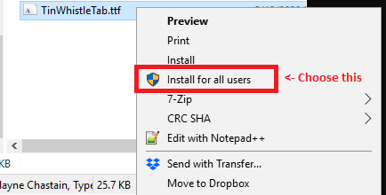

# tin-whistle-tablature
[MuseScore plugin](https://musescore.org/en/project/tin-whistle-tablature) to add tablature / finger diagrams to a tin whistle staff in a score

### Introduction
This provides a plugin to automatically add fingering / tab diagrams to the
notes in scores for tin whistle. The plugin will adjust for tin whistles tuned
to D, C and Bb, according to the instrument defined for each staff. Note that
if the staff instrument is not a whistle then no tabs are applied, otherwise the
plugin will adjust the tab diagram position for the lowest note possible
(currently D, C or Bb).

See the "Here be Dragons" section of this document that discusses various
quirks related to early MuseScore 3 releases.

### Installation
* If using MuseScore 3 (version 3.4 or later) then download the [plugin](https://musescore.org/sites/musescore.org/files/2020-06/tin-whistle-tablature-3.4.zip) and unzip it.

* If using MuseScore version 3.3 or earlier then download this [plugin](https://musescore.org/sites/musescore.org/files/2019-10/tin-whistle-tablature-master.zip).

* Alternatively if using the older MuseScore version 2 then download this [plugin](https://musescore.org/sites/musescore.org/files/2019-10/tin-whistle-tablature-version2.zip).

* Install using the [instructions](https://musescore.org/en/handbook/3/plugins#installation) in the MuseScore 3.x Handbook, which typically 
involves copying the QML file to the local MuseScore Plugin directory. If you 
are using MuseScore version 2.x then use this [handbook](https://musescore.org/en/handbook/plugins#installation) instead.

* Open MuseScore and navigate to ['Plugins' -> 'Plugin Manager'](https://musescore.org/en/handbook/3/plugins#enable-disable-plugins)
to enable the plugin. Tick the box against 'tin\_whistle\_tablature' and apply
with 'OK'.

* This plugin relies on a tin whistle tablature font being installed. Note that the 
font is not included in this download but can be obtained from 
[Blayne Chastain's site](https://www.blaynechastain.com/wp-content/uploads/TinWhistleTab.zip). 
If the font isn't installed you will be presented with a message box telling you 
how to obtain the font. To install the font, it is usually just a case of double-clicking 
the downloaded `.ttf` file and agreeing to the install process. If that does not work then 
on linux systems try copying the TinWhistleTab.ttf font file to the `/usr/share/fonts/truetype/` directory.
However, if you are installing the font on a Windows 10 system you will need to ensure you install the font
for "all users". You can do this by right clicking on the file and selecting "Install for all users"
as illustrated here:

 

 For more information on this Windows 10 font problem and solutions see issue
 [musescore/MuseScore#6084](https://github.com/musescore/MuseScore/pull/6084) and
 [how-to-force-win10-to-install-fonts-in-c-windows-fonts](https://stackoverflow.com/questions/55264642/how-to-force-win10-to-install-fonts-in-c-windows-fonts).

### Using the plugin
The tabs will be added to the highlighted bars if you have made a selection,
otherwise the whole score will have tabs added. Here is an example score before
applying the tabs:

When you wish to apply the tabs then navigate to 'Plugins' -> 'Tin Whistle' ->
'Add tablature'. Here is the score with the tabs now applied:

and the equivelent if using MuseScore 2 :

You can back out by navigating to 'Edit' -> 'Undo'.

### Other stuff
MuseScore Plugin API compatibility: 2.x

Issues: https://github.com/jgadsden/tin-whistle-tablature/issues

MuseScore issue tracker: https://musescore.org/en/project/issues/TinWhistleTablature

License: https://github.com/jgadsden/tin-whistle-tablature/blob/main/LICENSE

Download version 3 plugin from:
https://github.com/jgadsden/tin-whistle-tablature/archive/main.zip

Download the older version 2 plugin from:
https://github.com/jgadsden/tin-whistle-tablature/archive/version2.zip

Code repository: https://github.com/jgadsden/tin-whistle-tablature/

There are two branches for this plugin in the code repository: one for
MuseScore 2.x on a branch 'version2' and the other for Musecore 3.x on the
'main' branch.

### Here be Dragons
The version for MuseScore 2 will check that the staff is for a tin whistle and
adjust the tab diagram position for the lowest note possible.

Prior to MuseScore 3.2:

* The instrument type used on a staff can NOT be detected. In this case the plugin will 
assume that a whistle tuned to D is used - this being the most common whistle. 

* This plugin only supports grace notes that lead the main note. Tabs for trailing grace 
notes will be rendered as leading notes which is not what you want. In fact the trailing 
notes will be out of order. 

Prior to MuseScore 3.3:

* You may see some minor issues with grace note tab positioning. The actual physical 
position of the grace notes was not available before v3.3 so a heuristic approach 
(aka good 'ole human observation) is used to get a decent overall result even though 
it's not perfect.

Here is an example of how the fingering tab images are accurately positioned in MuseScore 3.3+:

### Having problems?
Note that this plugin relies on a font being installed, see the Installation
instructions.

The plugin will skip any staffs that are not for a Tin Whistle, so for example
if the staff is for the Irish Flute then it will not apply the tabs. This makes
sense as other instrument's fingering will be different.

